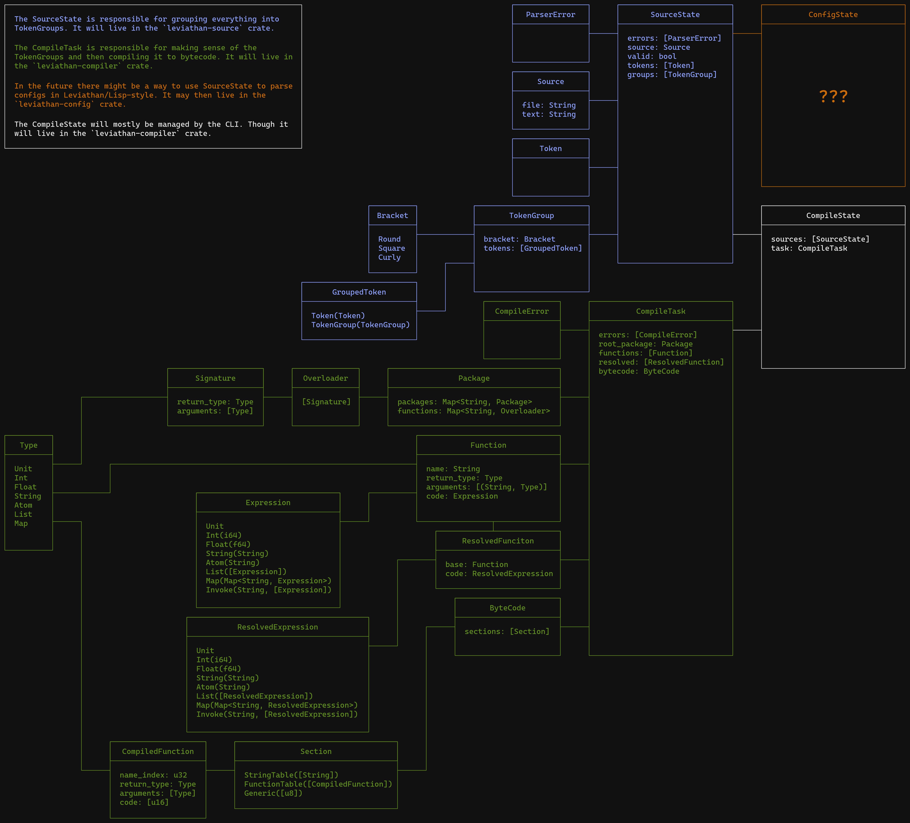

# TODO

## Major
* [ ] Migrate to from Structure to [Source](leviathan-common/src/structure.rs#L23)

## Minor
* [ ] Deny no-whitespace between elements (e.g. "(x)(y)" should not be valid)
* [ ] Implement bool
* [ ] Add checking logic
* [ ] Improve error messages
* [ ] Improve TextPosition logging
* [ ] Move strings instead of cloning
* [x] Increase use of move as an alternative to cloning
* [ ] Add importing
  * [ ] Add basic importing
  * [ ] Add prelude imports
* [ ] Add bytecode
* [ ] Add documentation
* [ ] Add standard library
* [ ] Add runtime library
* [ ] Improve rules for function naming in [Structure](leviathan-parser/src/structure_parser.rs)
* [ ] Check for correctness of namespaces
* [ ] Add support for types
* [x] Add return types
* [ ] Add function overloading

## BuildStructure
1. collect all the functions and their bodies into a single structure
2. map the namespaces of all resolved functions to an abstraction over all overloads
3. resolve imports
